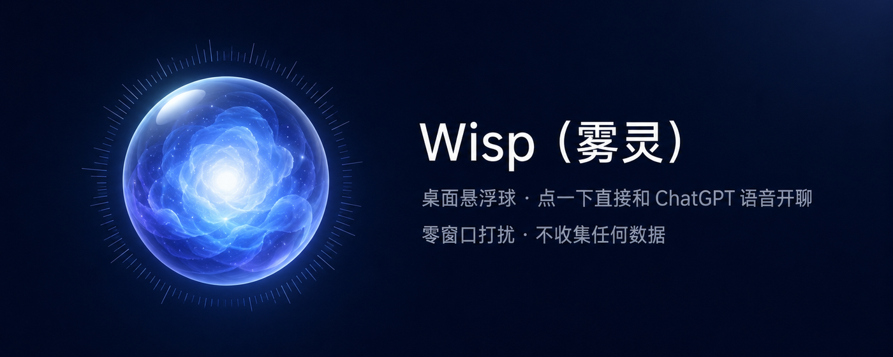
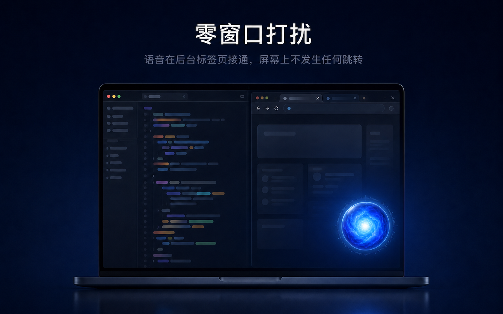
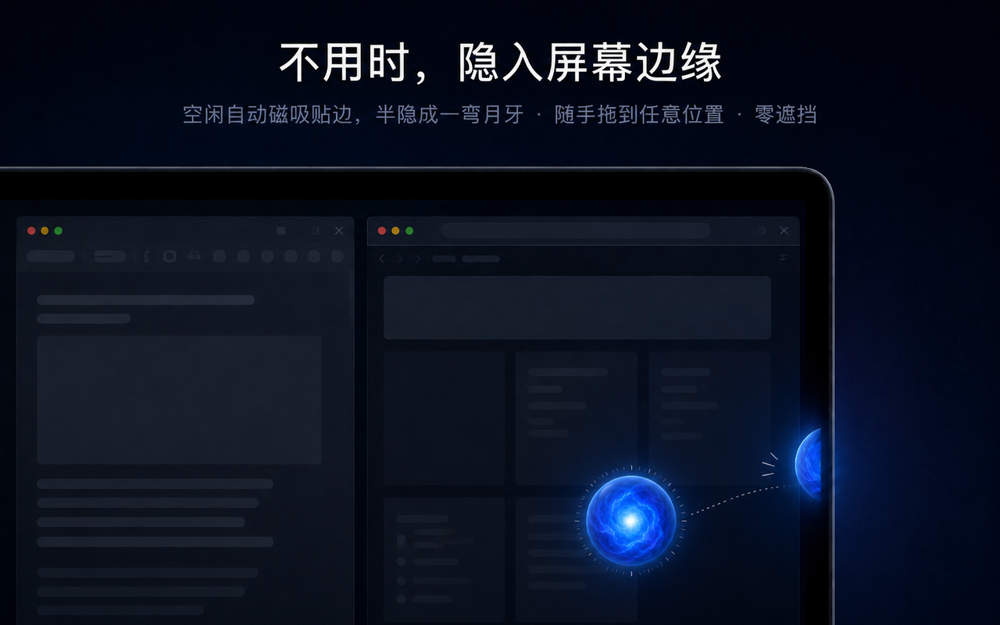

# Wisp（雾灵）



桌面上一颗液态玻璃悬浮球。点一下，直接和 ChatGPT 官方实时语音开聊。

A liquid-glass orb on your macOS desktop — one click to start a realtime voice chat with ChatGPT's official GPT Live, on your own Plus subscription.

## 它解决什么问题

ChatGPT 的实时语音（GPT Live）是目前体验最好的语音对话：反应快、可以随时打断、背后是 GPT-5.5 / 5.6。但它的入口太深——想说句话，要先切到浏览器、翻出 ChatGPT 标签页、再点开语音。等这套动作做完，你想随口问的那句话已经懒得问了。

Wisp 把这条路径压成一次点击。悬浮球常驻桌面角落，任何时刻点它（或按 `⌥⌘V`），一两秒后就能开口；说完再点一下挂断。全程不切窗口、不跳转页面，手头的事不会被打断。

## 适合谁

- **习惯语音交互的人**——查东西、聊想法、让 AI 陪你把一个问题说清楚，说话比打字快得多
- **用语音学习的人**——练口语、听讲解、通勤时把当天的问题过一遍，随叫随到
- **需要一个"随时在"的对话对象**——实时语音的陪伴感和情绪价值，是文字给不了的

用你自己的 ChatGPT Plus 订阅，不需要 API key，没有额外费用。

## 安装

```bash
curl -fsSL https://raw.githubusercontent.com/0xtootoo29/wisp/main/install.sh | bash
```

装完自动弹出三步引导，跟着走完就能用：

1. 安装 App —— 已完成 ✓
2. 到 Chrome 商店装配套扩展（一次点击，装好后引导窗自动打勾）
3. 登录 ChatGPT，引导窗一键帮你打开并固定标签页

## 使用前提

只有两条：

1. **Chrome 里常驻一个已登录 ChatGPT 的标签页**（引导会帮你固定好，之后不用管它）
2. **装配套 Chrome 扩展**——它负责让后台标签页保持语音连接，并在你点球时替你按下页面上的语音按钮

满足之后就是零窗口打扰：语音在后台标签页接通，屏幕上不发生任何跳转。



## 功能

- **一键起停**：点球或 `⌥⌘V` 开聊，再点挂断；你在网页里手动挂断，球的状态也会实时同步
- **悬浮球**：5 款玻璃球皮肤，随处拖放；空闲自动磁吸贴边、半隐成月牙零遮挡，多显示器每块屏的边界都能吸附

  
- **菜单栏面板**：通话状态、起停按钮、换肤、深浅色切换，都在一个下拉面板里
- **自诊断**：点「诊断：为什么用不了？」，自动检查三个环节，哪一步断了直接给你修复按钮
- **外观**：深浅色跟随系统，也可手动锁定

## 工作方式

一句话：Wisp 不碰 API、不逆向协议，它只是在你自己的 Chrome 里，替你点了 chatgpt.com 页面上那个官方语音按钮。

所有通信都在本机完成，不经过任何第三方服务器，不收集任何数据。详见[隐私政策](PRIVACY.md)。

## 要求

macOS 13+ · Google Chrome · ChatGPT 账号（语音需 Plus 订阅）

## 从源码构建

```bash
git clone https://github.com/0xtootoo29/wisp && cd wisp
bash build.sh   # 编译并部署到 ~/Applications/Wisp.app
```

扩展开发版：`chrome://extensions` → 开发者模式 → 加载已解压的扩展程序 → 选 `extension/`。

## 卸载

```bash
curl -fsSL https://raw.githubusercontent.com/0xtootoo29/wisp/main/uninstall.sh | bash
```

## License

MIT
